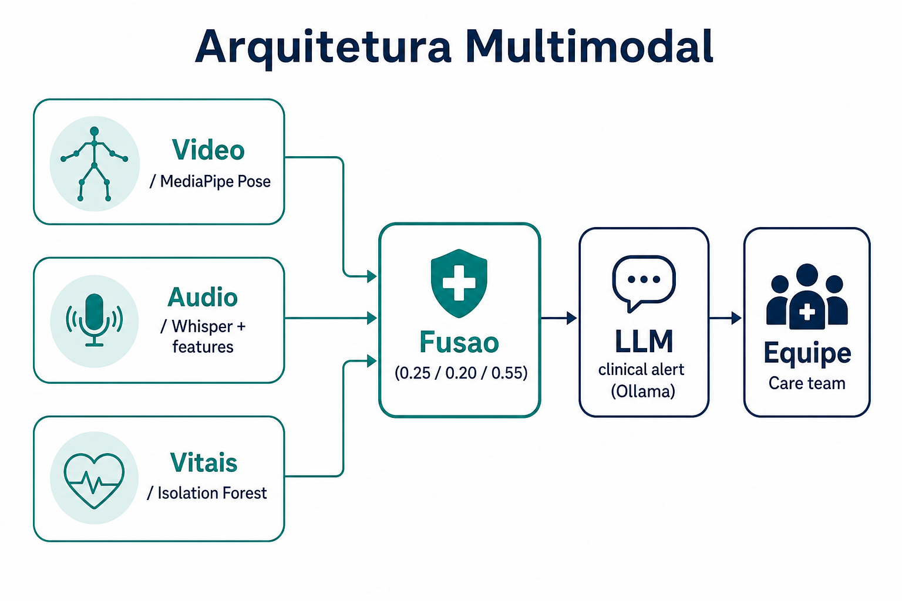
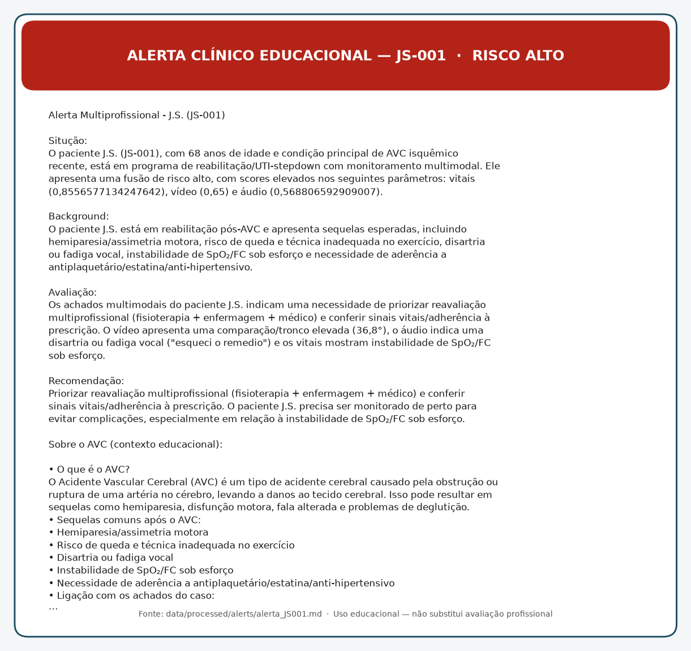

# TechChallenge Multimodais

Trabalho final da **Fase 4** (pós FIAP · 8IADT).

**Tema:** Monitoramento multimodal de pacientes em reabilitação/UTI com detecção de anomalias em tempo real.

> **Aviso educacional:** o sistema e o LLM clínico **não** substituem avaliação profissional de saúde.

## Objetivo

Analisar e fusionar três modalidades de um paciente fictício em reabilitação/UTI:

| Modalidade | O que entra | O que sai |
|---|---|---|
| **Vídeo** | Exercício de fisioterapia (MediaPipe Pose) | Score motor + alertas de forma |
| **Áudio** | Features vocais (UCI Parkinson) + Whisper/check-in | Score de fala + termos críticos |
| **Vitais / texto** | Séries HR/SpO₂/PA + alvos de prescrição | Score de anomalia + violações |

Os scores são combinados na **fusão de risco** (pesos clínicos 0.25 / 0.20 / 0.55) e um **alerta SBAR** é gerado via Ollama (ou template fallback) para a equipe.

## Equipe
* Marcelo Mendonça Lira - RM369892
* Stefanie Barcelos de Franco - RM369893

**Casos demonstrados**

- **JS-001 (J.S.)** — pós-AVC, risco **alto** (~0.75)
- **MR-001 (M.R.)** — fisioterapia preventiva, risco **baixo** (~0.15)

Relatório completo: [`notebooks/Relatorio.ipynb`](notebooks/Relatorio.ipynb) · espelho: [`docs/relatorio_tecnico.md`](docs/relatorio_tecnico.md)

## Arquitetura multimodal



```text
Vídeo (MediaPipe)  ─┐
Áudio (Whisper/RF) ─┼→ Fusão (0.25 / 0.20 / 0.55) → LLM (Ollama) → Equipe
Vitais (IF / Rx)   ─┘
```

### Equivalência Azure → local

| Enunciado (Azure) | Este projeto |
|---|---|
| Speech to Text | Whisper (`openai-whisper`) |
| Text Analytics | Léxico de termos críticos + RF Parkinson |
| Resumo / serviços cognitivos | Ollama `llama3.2` + prompt clínico (extensão: LoRA médico HF) |

## Datasets — onde baixar

Coloque os arquivos nas pastas indicadas. **Vídeos já vêm no repositório** (`data/raw/videos/`). Datasets pesados de ECG **não** são versionados.

| Dataset | Link | Destino local |
|---|---|---|
| MIT-BIH Arrhythmia (`mitdb`) | https://physionet.org/content/mitdb/1.0.0/ | ZIP em `data/raw/vitals/` → pasta `mitdb/` |
| Normal Sinus Rhythm (`nsrdb`) | https://physionet.org/content/nsrdb/1.0.0/ | ZIP em `data/raw/vitals/` → pasta `nsrdb/` |
| ECG Fragment High-Risk | https://physionet.org/content/ecg-fragment-high-risk-label/1.0.0/ | ZIP em `data/raw/vitals/` → `ecg-fragment-high-risk/` |
| UCI Parkinsons (Oxford) | https://archive.ics.uci.edu/dataset/174/parkinsons | `data/raw/parkinsons/parkinsons.data` (+ telemonitoring opcional) |
| Vídeos de fisioterapia | *incluídos no repo* | `data/raw/videos/*.mp4` |
| Vitais sintéticos JS/MR | gerados pelo código | `data/raw/vitals/synthetic/` |

**Extração PhysioNet:** após copiar os ZIPs para `data/raw/vitals/`, use a célula §4.2 do Relatorio (`prepare_datasets_from_zips`) — fluxo idempotente, sem `wfdb.dl_database`.

## Modelos Hugging Face (adapter médico)

Extensão documentada para o “LLM médico” local. O MVP de alertas do Relatorio funciona com **Ollama** sem este download.

| Artefato | Repositório HF | Pasta local / env |
|---|---|---|
| Adapter LoRA médico | [StefanieFranco/llama3-medical-fine-tuning](https://huggingface.co/StefanieFranco/llama3-medical-fine-tuning) | `models/llama3-8b-bnb-4bit-medical/adapter` · `MEDICAL_ADAPTER_PATH` |
| Base Llama 3 Instruct | [meta-llama/Meta-Llama-3-8B-Instruct](https://huggingface.co/meta-llama/Meta-Llama-3-8B-Instruct) | `models/base/Meta-Llama-3-8B-Instruct` · `LOCAL_LLAMA_MODEL_PATH` |

**Pré-requisitos**

1. Conta no [Hugging Face](https://huggingface.co/)
2. Aceitar os termos do modelo Llama 3 na página do repositório gated
3. Autenticar no terminal:

```powershell
hf auth login
```

4. Baixar base + adapter:

```powershell
python -m src.fine_tuning.download_local_llama
```

Código: [`src/fine_tuning/download_local_llama.py`](src/fine_tuning/download_local_llama.py).  
Variáveis em `.env` (ver `.env.example`):

```env
LOCAL_LLAMA_MODEL_PATH=./models/base/Meta-Llama-3-8B-Instruct
MEDICAL_ADAPTER_PATH=./models/llama3-8b-bnb-4bit-medical/adapter
```

> O download da base 8B é **grande** e gated. Para a demo rápida, use só `ollama pull llama3.2`.

## Instalação passo a passo (Windows)

### 1. Clone e ambiente

```powershell
git clone <url-do-repositorio>
cd TechChallenge-Multimodais

python -m venv .venv
.\.venv\Scripts\Activate.ps1
pip install -r requirements.txt
```

Se a política de scripts bloquear o activate:

```powershell
Set-ExecutionPolicy -ExecutionPolicy RemoteSigned -Scope CurrentUser
```

### 2. (Opcional) Kernel Jupyter

```powershell
python -m ipykernel install --user --name=techchallenge-multimodais --display-name="Python (.venv TechChallenge)"
```

### 3. Datasets

1. Baixe os ZIPs PhysioNet e o UCI Parkinson (tabela acima).
2. Copie os ZIPs para `data/raw/vitals/` e o `parkinsons.data` para `data/raw/parkinsons/`.
3. Abra [`notebooks/Relatorio.ipynb`](notebooks/Relatorio.ipynb) e rode §4.2 (extração) + seções seguintes, **ou** execute os scripts da pasta `scripts/`.

Os vídeos em `data/raw/videos/` já devem estar presentes após o `git clone`.

### 4. Ollama (alertas LLM)

Instale o [Ollama](https://ollama.com/) e puxe o modelo:

```powershell
ollama pull llama3.2
```

Sem Ollama, o código gera um **fallback clínico** em Markdown (ainda educacional).

### 5. Hugging Face LoRA

```powershell
hf auth login
python -m src.fine_tuning.download_local_llama
```

### 6. Rodar a demo de fusão / alertas

```powershell
python scripts/run_fusion_pipeline_into_relatorio.py
python scripts/add_low_risk_case_relatorio.py
```

Artefatos: `data/processed/alerts/alerta_JS001.md`, `alerta_MR001.md`.

## 8. Resultados

Resumo espelhado do Relatorio (§8):

| Modalidade | Métrica / evidência | Exemplo de anomalia |
|---|---|---|
| Vídeo | score fusão=0.650; veredito=INCORRETO | Agachamento INCORRETO (`22.03.28`) — joelho além do pé |
| Áudio | RF acc≈0.918, F1_PD≈0.943; voice_risk≈0.569 | Termos: falta de ar, esqueci o remédio, dor no peito, cansaço, tontura |
| Vitais | IF sintético risk≈0.856; IF-ECG F1≈0.478; sens. high-risk≈0.58 | SpO₂/HR fora de alvo; janelas ECG `abnormal` |
| Fusão + alerta | risco≈**0.747 (alto)**; pesos 0.25/0.20/0.55 | Alerta SBAR clínico — `alerta_JS001.md` |

**Contraste:** MR-001 fusão≈**0.147 (baixo)** vs JS-001≈**0.747 (alto)**.

**Pesos:** iguais (1/3) seriam a baseline; no MVP priorizamos vitais (0.55) > motor (0.25) > áudio proxy (0.20).

## Exemplo de alerta (JS-001)

Arquivo gerado: [`data/processed/alerts/alerta_JS001.md`](data/processed/alerts/alerta_JS001.md)



## Estrutura do repositório

```text
techchallenge-multimodais/
├── README.md
├── requirements.txt
├── .env.example
├── data/
│   ├── raw/videos/       # clipes (no git)
│   ├── raw/vitals/       # PhysioNet + synthetic (baixar / gerar)
│   ├── raw/parkinsons/   # UCI (baixar)
│   └── processed/alerts/ # alertas Markdown
├── docs/
│   ├── assets/           # imagens do README
│   ├── relatorio_tecnico.md
│   └── roteiro_video_demo.md
├── src/                  # video, audio, vitals, fusion, llm, alerts, fine_tuning
├── scripts/              # pipelines → Relatorio
└── notebooks/Relatorio.ipynb
```

## Entregáveis da Fase 4

- Repositório com código + relatório (fluxo, modelos, resultados)
- Vídeo ≤ 15 min (YouTube/Vimeo) — roteiro em [`docs/roteiro_video_demo.md`](docs/roteiro_video_demo.md)
